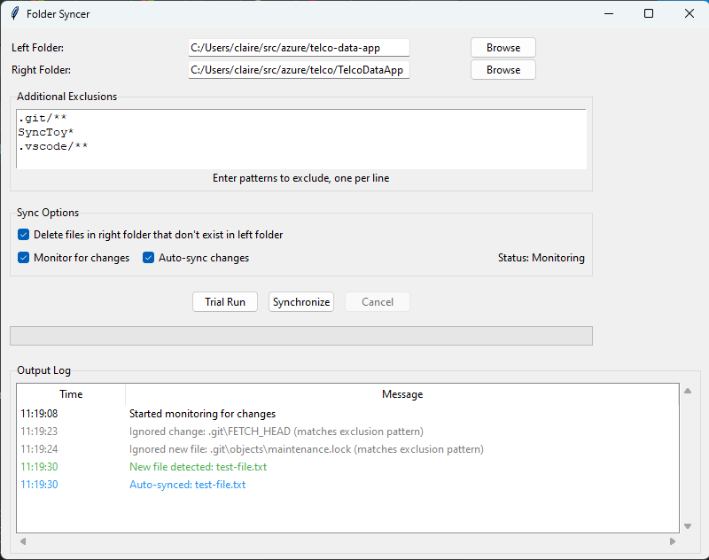

# Folder Syncer
A Python application for synchronizing folders with real-time monitoring capabilities. This tool helps you keep two folders in sync while respecting .gitignore patterns and custom exclusions.


## Features

- **Two-Way Folder Synchronization**
  - Sync files from a source folder to a destination folder
  - Respect .gitignore patterns automatically
  - Support for custom file/directory exclusions
  - Option to delete files in destination that don't exist in source

- **Real-Time Monitoring**
  - Watch source folder for changes
  - Auto-sync changes as they happen
  - Cooldown system to prevent duplicate events
  - Monitor status indicator

- **Smart Sync Features**
  - Trial run mode to preview changes
  - Progress tracking for sync operations
  - Detailed logging of all operations
  - Cancellable sync operations
  - Empty directory cleanup

- **User-Friendly Interface**
  - Simple folder selection with browse buttons
  - Easy-to-use exclusion patterns
  - Clear status messages
  - Persistent settings between sessions

## Quick Start

### Running from Source
1. Ensure you have Python 3.6 or later installed
2. Install required dependencies:
   ```bash
   pip install watchdog
   ```
3. Run the application:
   ```bash
   python src/main.py
   ```

### Using Pre-built Binaries
1. Download the latest release for your platform from the GitHub releases page
2. Extract the archive
3. Run the FolderSyncer executable

## Usage

1. Select Source and Destination Folders:
   - Click "Browse" next to "Left Folder" to select your source folder
   - Click "Browse" next to "Right Folder" to select your destination folder

2. Configure Sync Options:
   - Check/uncheck "Delete files in right folder that don't exist in left folder"
   - Add custom exclusion patterns in the "Additional Exclusions" text area
   - Enable/disable "Monitor for changes" for real-time sync
   - Enable/disable "Auto-sync changes" when monitoring is active

3. Perform Sync Operations:
   - Click "Trial Run" to see what changes would be made
   - Click "Synchronize" to perform the actual sync
   - Use "Cancel" to stop a running sync operation

## Project Structure

```
.
├── src/                  # Source code
│   ├── main.py          # Entry point
│   └── lib/             # Core modules
├── resources/           # Application resources
│   ├── icon.ico        # Windows icon
│   └── icon.icns       # macOS icon
├── build.py            # Build script
├── README.md           # This file
├── LICENSE            # MIT License
└── .gitignore        # Git ignore patterns
```

## Automated Builds and Releases

The project uses GitHub Actions to automatically build and release executables for Windows, Linux, and macOS.

### Creating a New Release

You can create a new release in two ways:

#### Method 1: Through GitHub's Website
1. Go to your repository on GitHub
2. Click on "Releases" on the right side
3. Click "Create a new release"
4. Create a new tag (e.g., "v1.0.0") in the tag field
5. Fill in the release title and description
6. Click "Publish release"

#### Method 2: Using Git Command Line
1. Create and push a new version tag:
   ```bash
   git tag -a v1.0.0 -m "Release version 1.0.0"
   git push origin v1.0.0
   ```

Both methods will trigger the GitHub Actions workflow to:
- Build executables for all platforms
- Create a new GitHub release
- Upload the built executables as release assets

### Available Builds

Each release includes pre-built executables for:
- Windows (file-syncer-windows.exe)
- Linux (file-syncer-linux)
- macOS (file-syncer-macos)

## Building from Source

### Prerequisites
- Python 3.6 or later
- pip package manager
- Platform-specific build tools

### Using the Build Script

1. Install build requirements:
   ```bash
   pip install pyinstaller watchdog
   ```

2. Run the build script:
   ```bash
   python build.py
   ```

The executable will be created in the `dist` directory.

### Manual Building

#### Windows Users
```bash
# Just double-click build_windows.bat
# Or run from command line:
build_windows.bat
```

#### Linux/macOS Users
```bash
# Make the script executable
chmod +x build_unix.sh
# Run the script
./build_unix.sh
```

These scripts will:
1. Create a clean virtual environment
2. Install all required dependencies
3. Build the application
4. Place the executable in the `dist` directory

### Manual Build Process

If you prefer to build manually or the quick build scripts don't work for your environment:

1. Create a virtual environment:
   ```bash
   # Windows
   python -m venv venv
   .\venv\Scripts\activate

   # Linux/macOS
   python3 -m venv venv
   source venv/bin/activate
   ```

2. Install requirements:
   ```bash
   pip install -r requirements.txt
   ```

3. Run the build script:
   ```bash
   python build.py
   ```

### Anaconda Users

If you're using Anaconda, please use a clean virtual environment instead:

1. Create and activate a new environment:
   ```bash
   conda create -n syncer-build python=3.9
   conda activate syncer-build
   ```

2. Install requirements and build:
   ```bash
   pip install -r requirements.txt
   python build.py
   ```

### Build Scripts

The project includes three different build scripts for convenience:

1. `build.py` - Main build script
   - Platform-independent Python script
   - Handles all build configurations
   - Provides detailed progress and error messages
   - Supports different build options

2. `build_windows.bat` - Windows helper script
   - Creates clean virtual environment
   - Installs dependencies
   - Runs build process
   - Easy double-click execution

3. `build_unix.sh` - Linux/macOS helper script
   - Creates clean virtual environment
   - Installs dependencies
   - Runs build process
   - Proper shell script permissions required

Choose the script that best matches your platform and needs:
- Windows users: Use `build_windows.bat` for easiest experience
- Linux/macOS users: Use `build_unix.sh` after setting execute permission
- Advanced users: Use `build.py` directly for more control

## Contributing

1. Fork the repository
2. Create a feature branch
3. Commit your changes
4. Push to the branch
5. Create a Pull Request

## License

This project is licensed under the MIT License - see the LICENSE file for details.

## Acknowledgments

- watchdog library for file system monitoring
- tkinter for the GUI framework
- PyInstaller for application bundling
